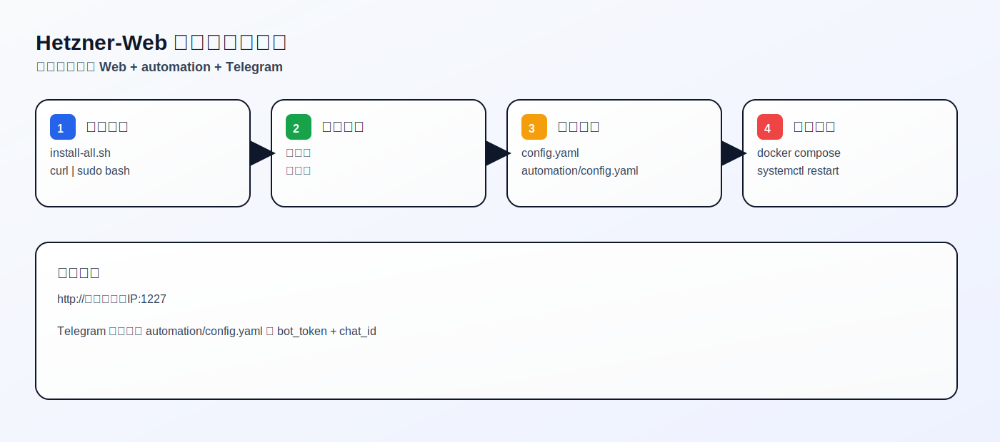
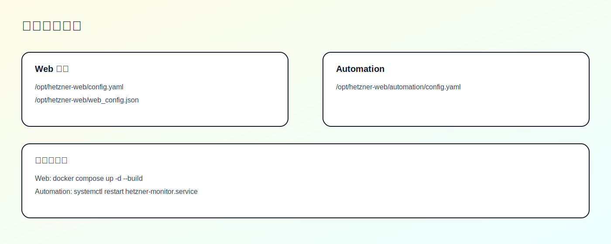
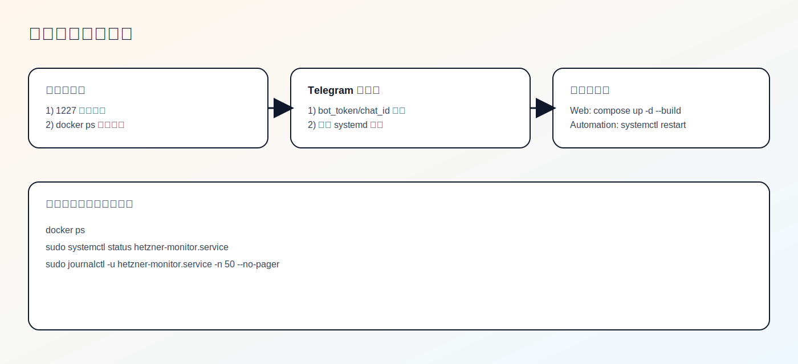

# Hetzner Web

[English](README.md) | [中文](README.zh.md)

[](LICENSE)
[](#30-second-quick-start-all-in-one)

A lightweight Hetzner traffic dashboard + automation monitor. Includes a web UI, Telegram alerts/commands, auto rebuilds, and DNS checks.

---

## 30-second quick start (all-in-one)

If this is your first time, use the **all-in-one script** to install Web + automation + Telegram support in one go.

```bash
curl -fsSL https://raw.githubusercontent.com/liuweiqiang0523/Hetzner-Web/main/scripts/install-all.sh | sudo bash
```

Then continue with **Config Setup** below.



---

## Which install do I need?

- New users: use the **all-in-one script** (Web + automation + Telegram).
- Web-only dashboard: use the **Web install script**.
- Automation-only: use the **automation install script**.

---

## Check prerequisites (beginner-friendly)

Make sure these commands exist:

```bash
git --version
python3 --version
docker --version
docker compose version
systemctl --version
```

If any are missing, install them first (Ubuntu/Debian: `apt`).

---

## All-in-one install (recommended)

### 1) Run the installer

```bash
curl -fsSL https://raw.githubusercontent.com/liuweiqiang0523/Hetzner-Web/main/scripts/install-all.sh | sudo bash
```

### 2) Fill in configs (important)

**Web config:**
- `config.yaml`: set `hetzner.api_token`
- `web_config.json`: set `username` / `password`

**Automation config:**
- `automation/config.yaml`: set Hetzner/Telegram/Cloudflare if needed

> Note: if `HETZNER_API_TOKEN` was not provided, the script uses example config. You must edit it manually.

### 3) Restart to apply

```bash
cd /opt/hetzner-web

docker compose up -d --build
sudo systemctl restart hetzner-monitor.service
```

### 4) Open the dashboard

Open: `http://<your-server-ip>:1227`

---

## Telegram setup (most used)

In `automation/config.yaml`:

```yaml
telegram:
  enabled: true
  bot_token: "YOUR_BOT_TOKEN"
  chat_id: "YOUR_CHAT_ID"
```

Then restart automation:

```bash
sudo systemctl restart hetzner-monitor.service
```

---

## Web-only install (optional)

```bash
curl -fsSL https://raw.githubusercontent.com/liuweiqiang0523/Hetzner-Web/main/scripts/install-docker.sh | bash
```

Edit `config.yaml` + `web_config.json`, then:

```bash
docker compose up -d --build
```

---

## Automation-only install (optional)

```bash
curl -fsSL https://raw.githubusercontent.com/liuweiqiang0523/Hetzner-Web/main/automation/install_hetzner_monitor.sh | sudo bash
```

Edit `automation/config.yaml`, then:

```bash
sudo systemctl restart hetzner-monitor.service
```

---

## Will this affect an existing deployment?

By default, **no**.

The all-in-one script exits if the install directory already exists, to avoid touching your current setup.

If you really want to update an existing install (not beginner-friendly):

```bash
curl -fsSL https://raw.githubusercontent.com/liuweiqiang0523/Hetzner-Web/main/scripts/install-all.sh | sudo ALLOW_UPDATE=1 bash
```

---

## Config file locations



- Web: `/opt/hetzner-web/config.yaml`
- Web login: `/opt/hetzner-web/web_config.json`
- Automation: `/opt/hetzner-web/automation/config.yaml`

---

## Troubleshooting (visual guide)



Quick checks:
- `docker ps`
- `sudo systemctl status hetzner-monitor.service`
- `sudo journalctl -u hetzner-monitor.service -n 50 --no-pager`

---

## Project layout

- Web dashboard (this directory): FastAPI + Vue, Docker-first
- Automation monitor: `automation/` (CLI/systemd service)

More docs:
- Automation docs: `automation/README.md`

---

## Features

- Real-time server traffic (outbound/inbound)
- Daily/hourly breakdown tables + per-server bars
- DNS check/sync + rebuild actions
- Telegram bot for query + control commands
- Snapshot rebuild + create from snapshot
- Scheduler for timed delete/create
- Trend sparkline per server
- Basic Auth login

---

## Security notes

- `config.yaml` / `web_config.json` / `automation/config.yaml` are sensitive. Do not commit them.
- Use HTTPS reverse proxy for public access.
